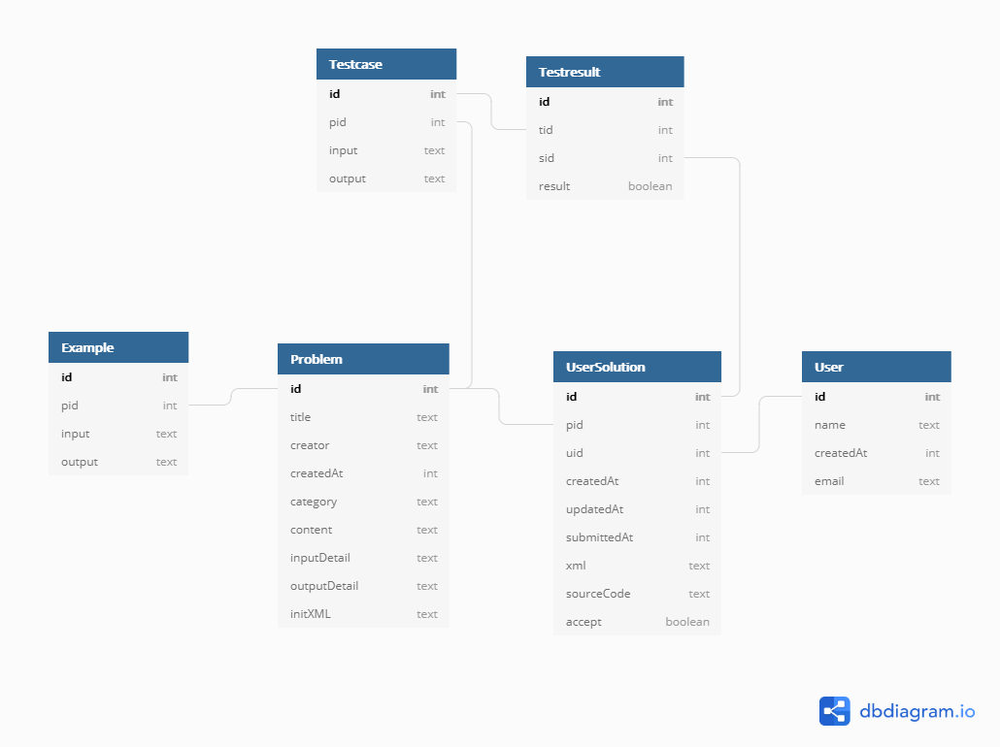

**Block Solve ER Diagram**
----



**BlockSolve API Document**
----

  Returns json data about a single user.


**1. URL**	/problems

* **Method:**

  `GET`
  
* **Request and Response:**

  * **URL Params**
  
    **Required:**
  
    None
  
  * **Data Params**
  
    * page
  
    * category
  
      /problems?page=1&category=수학
  
  ```json
  {
    "data": [
      {
        "category": "수학",
        "content": "두 정수 A와 B를 입력받은 다음, A+B를 출력하는 프로그램을 작성하시오",
        "correctRate": 0.45,
        "createdAt": 1570095736460,
        "creator": "도깨비",
        "id": 1000,
        "initXML": "<xml></xml>",
        "inputDetail": "첫째 줄에 A와 B가 주어진다. (0 < A, B < 10)",
        "numSub": 225649,
        "outputDetail": "첫째 줄에 A+B를 출력한다.",
        "title": "A+B"
      },
      {
        "category": "수학",
        "content": "두 정수 A와 B를 입력받은 다음, A-B를 출력하는 프로그램을 작성하시오",
        "correctRate": 0.72,
        "createdAt": 1570095835460,
        "creator": "비가와용",
        "id": 1001,
        "initXML": "<xml></xml>\r\n",
        "inputDetail": "첫째 줄에 A와 B가 주어진다. (0 < A, B < 10)",
        "numSub": 97352,
        "outputDetail": "첫째 줄에 A-B를 출력한다.",
        "title": "A-B"
      }
    ],
    "result": true
  }
  ```

**2. URL**    /problems/:pid

* **Method:**

  `GET`

* **Request and Response:**

  * **URL Params**
  
    **Required:**
  
    `pid=[integer]`
  
  * **Data Params**
  
    None
  
  ```json
  {
    "data": {
      "category": "수학",
      "content": "두 정수 A와 B를 입력받은 다음, A+B를 출력하는 프로그램을 작성하시오",
      "correctRate": 0.45,
      "createdAt": 1570095736460,
      "creator": "도깨비",
      "examples": [
        {
          "input": "2 3",
          "output": "5"
        },
        {
          "input": "500 222",
          "output": "722"
        },
        {
          "input": "4256 99",
          "output": "4355"
        }
      ],
      "id": 1000,
      "initXML": "<xml></xml>",
      "inputDetail": "첫째 줄에 A와 B가 주어진다. (0 < A, B < 10)",
      "numSub": 225649,
      "outputDetail": "첫째 줄에 A+B를 출력한다.",
      "title": "A+B"
    },
    "result": true
  }
  ```

**3) URL**    /save

* **Method:**

  `GET` | `POST` 

* **Request and Response:** 

  *  `POST` 

    * request 

    ```json
    {
    		"pid": 1000, 
    		"uid": 1,
    		"postedAt": 2155, 
    		"xml":"<xml>fgddfdd</xml>"
    }
    ```

    * response

    한 번도 저장되지 않은 solution일 때 response

    ```json
    {
      "UserSolutionID": 1,
      "msg": "Successful to create solution.",
      "result": true
    }
    ```

    한 번이상 저장된 solution일 때 response

    ```json
    {
      "UserSolutionID": 1,
      "msg": "Successful to save solution.",
      "result": true
    }
    ```

  * `GET` 

    * **URL Params**
    
      **Required:**
    
      None
      
    * **Data Params**
      
      * uid
      
      * pid
      
        /save?uid=1&pid=1000
    
    ```json
    {
      "err_msg": "Not found. Check uid and pid.",
      "result": false
    }
    ```
    
     한 번도 저장되지 않은 solution일 때 response
    
    ```json
    {
      "UserSolutionID": 1,
      "data": [
        {
      "accept": null,
          "createdAt": 1543062625477,
      "id": 1,
          "pid": 1001,
          "sourceCode": null,
          "submittedAt": null,
          "uid": 1,
          "updatedAt": null,
          "xml": "<xml></xml>"
        }
      ],
      "result": true
    }
    ```
    
    한 번이상 저장된 solution일 때 response
    
    ```json
    {
      "UserSolutionID": 1,
      "data": [
        {
          "accept": null,
          "createdAt": 1543062625477,
          "id": 1,
          "pid": 1001,
          "sourceCode": null,
          "submittedAt": null,
          "uid": 1,
          "updatedAt": 1543062735494,
          "xml": "<xml></xml>"
        }
      ],
      "result": true
    }
    ```

**4) URL**    /submit

* **Method:**

  `GET` | `POST` 

* **Request and Response:** 

  * `POST` 

    * request 

    ```json
    {
    		"pid": 1000, 
    		"uid": 1,
    		"postedAt": 2155, 
    		"xml":"<xml>print(a+b)</xml>",
        	"sourceCode": "print(a+b)"
    }
    ```

    * response

      한 번도 제출되지 않은 solution일 때 response

     ```json
      {
        "data": {
          "accept": true,
          "testResult": [
            {
              "id": 1,
              "result": true,
              "scoredAt": 1574900472404,
              "sid": 1,
              "tid": 1
            },
            {
              "id": 2,
              "result": true,
              "scoredAt": 1574900472421,
              "sid": 1,
              "tid": 2
            },
            {
              "id": 3,
              "result": true,
              "scoredAt": 1574900472436,
              "sid": 1,
              "tid": 3
            }
          ]
        },
        "msg": "Successful to create and submit solution.",
        "result": true
      }
      ```
  
      * 저장되었던  solution일 때 response
  
       ```json
        {
          "data": {
            "accept": true,
            "testResult": [
              {
                "id": 1,
                "result": true,
                "scoredAt": 1574900472404,
                "sid": 1,
                "tid": 1
              },
              {
                "id": 2,
                "result": true,
                "scoredAt": 1574900472421,
                "sid": 1,
                "tid": 2
              },
              {
                "id": 3,
                "result": true,
                "scoredAt": 1574900472436,
                "sid": 1,
                "tid": 3
              }
            ]
          },
          "msg": "Successful to submit solution.",
          "result": true
        }
        ```
      
        
    
      

  * `GET` 
  
    * request 
  
      * **Data Params**
  
        **Required**
  
        sid
  
        /submit?sid=1
  
    ```json
    {
      "data": [
        {
          "accept": true,
          "createdAt": 2132155,
          "id": 1,
          "pid": 1000,
          "sourceCode": "print(a+b)",
          "submittedAt": 2132155,
          "uid": 1,
          "updatedAt": 2132155,
          "xml": "<xml>z</xml>"
        }
      ],
      "result": true
    }
    ```

**5) URL**    /status/:uid

* **Method:**

  `GET` 

* **Request and Response:** 

  * request 

    * **URL Params**

      **Required:**

      `uid=[integer]`

    * **Data Params**

      - page

      - category

        /status/1?page=1&category=수학

        ```json
        {
          "data": [
            {
              "accept": true,
              "category": "수학",
              "createdAt": 2132155,
              "id": 1,
              "pid": 1000,
              "sourceCode": "print(a+b)",
              "submittedAt": 2132155,
              "testResult": [
                {
                  "id": 1,
                  "result": 1,
                  "scoredAt": 1574900472404,
                  "sid": 1,
                  "tid": 1
                },
                {
                  "id": 2,
                  "result": 1,
                  "scoredAt": 1574900472421,
                  "sid": 1,
                  "tid": 2
                },
                {
                  "id": 3,
                  "result": 1,
                  "scoredAt": 1574900472436,
                  "sid": 1,
                  "tid": 3
                }
              ],
              "title": "A+B",
              "uid": 1,
              "updatedAt": null,
              "xml": "<xml>z</xml>"
            }
          ],
          "result": true
        }
        ```

        
